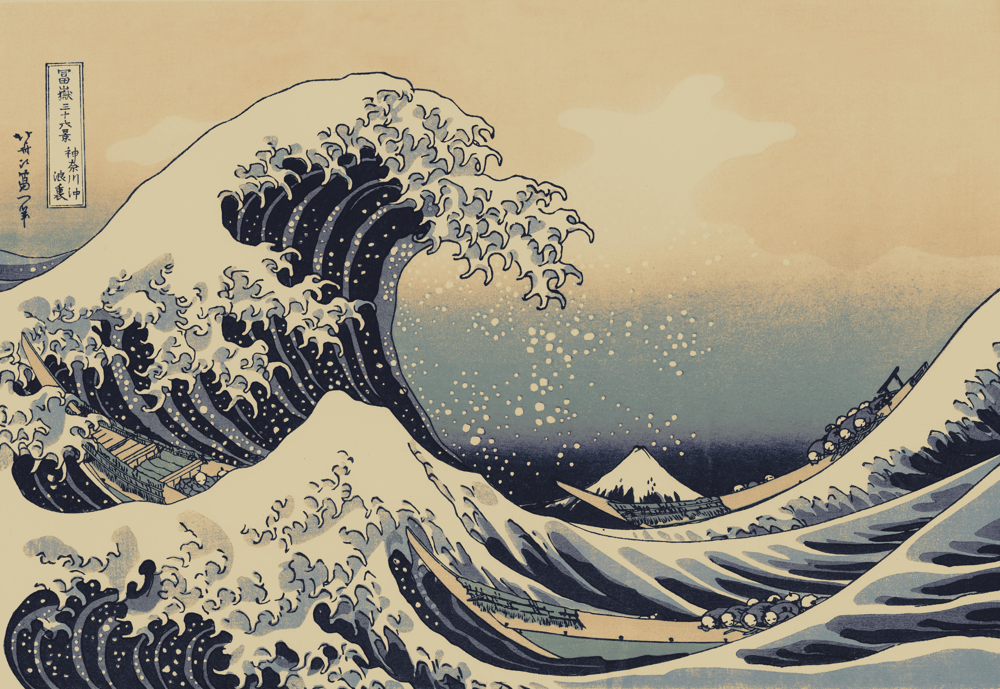
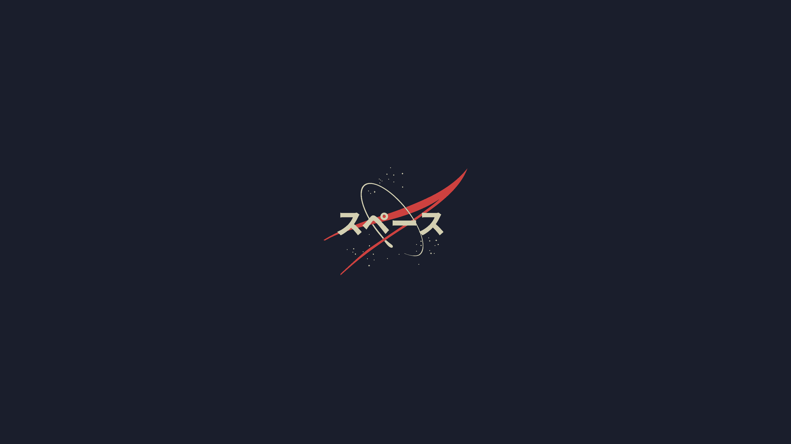

<h1 align="center">🌊 Ubuntu Ricing — Kanagawa Edition</h1>

<p align="center">
  <em>One command to turn a fresh Ubuntu GNOME install into a Kanagawa-themed developer workstation.</em>
</p>

<p align="center">
  
</p>

<p align="center">
  
  
  
  
</p>

<p align="center">
  
  
  
  
</p>

---

## 💡 The Idea

Setting up a new machine is tedious and easy to get wrong. This repo is a single, repeatable script
that installs the tools, applies the **Kanagawa Wave** aesthetic, and configures GNOME — so a blank
Ubuntu becomes a ready-to-code, good-looking workstation in one run.

It's built around three principles:

- **🔁 Idempotent** — every step checks before it acts. Already have Node, Rust, or Kitty? It's
  skipped. You can re-run `./install.sh` anytime without breaking things.
- **🛡️ Fault-tolerant** — if one module fails, the installer logs a warning and **keeps going** to
  the next one. App installs fall back from `apt` to Flatpak when needed.
- **🧩 Modular** — ten independent modules, each runnable on its own with `--only`. Want just the
  fonts or just the dev toolchains? Run only those.

---

## 🎨 Showcase

### Wallpapers

The Kanagawa wallpaper set ships with the repo and is applied automatically.

<table>
  <tr>
    <td align="center"><br/><sub>The Great Wave</sub></td>
    <td align="center"><br/><sub>Abstract (default)</sub></td>
    <td align="center"><br/><sub>Mountains Retreat</sub></td>
  </tr>
</table>

### Kanagawa Wave palette

The whole rice — terminal, prompt, fzf, GTK accents — is tuned to this palette.

| Swatch | Name | Hex |
| :----: | :--- | :-- |
|  | Sumi Ink (background) | `#1F1F28` |
|  | Sumi Ink 0 (darker)   | `#16161D` |
|  | Wave Blue (selection)  | `#2D4F67` |
|  | Fuji White (foreground)| `#DCD7BA` |
|  | Old White              | `#C8C093` |
|  | Crystal Blue           | `#7E9CD8` |
|  | Spring Blue            | `#7FB4CA` |
|  | Spring Green           | `#98BB6C` |
|  | Carp Yellow            | `#E6C384` |
|  | Wave Red               | `#E46876` |
|  | Oni Violet             | `#957FB8` |
|  | Wave Aqua              | `#7AA89F` |

---

## 📦 What's Inside

Run order top-to-bottom. Each row is a module you can also run on its own (see [Quick Start](#-quick-start)).

| Module | What it sets up |
| :--- | :--- |
| `fonts` | JetBrains Mono Nerd Font · Inter (GNOME UI font) |
| `dev/node` | nvm · Node LTS · pnpm · TypeScript · ts-node |
| `dev/python` | pyenv · Python 3.12.4 · Poetry |
| `dev/rust` | rustup · rustfmt · clippy · rust-analyzer |
| `gnome/themes` | Papirus icons · Nordic GTK theme · Bibata Modern Ice cursor |
| `gnome/extensions` | Blur my Shell · Just Perfection · Dash to Dock · User Themes (via `gnome-tweaks` + `gext`) |
| `dotfiles` | zsh · Oh My Zsh · Starship · Kitty · bat · fd · ripgrep · fzf · zoxide · btop · eza |
| `gnome/settings` | Dark mode · fonts · touchpad · Night Light · dock & blur tuning · default browser/terminal |
| `wallpapers` | Downloads & applies the Kanagawa wallpaper set |
| `apps` | Flatpak · Discord · Steam · Google Chrome · qBittorrent · Kitty · Claude Code |

---

## 🚀 Quick Start

```bash
git clone https://github.com/luizcunha3/ubuntu-ricing.git
cd ubuntu-ricing
./install.sh
```

> **Prerequisites** (`curl`, `git`, `unzip`, `software-properties-common`) are detected and
> installed automatically by a pre-flight check — you don't need to set anything up first.

When it finishes, **log out and log back in** so the GNOME theme, extensions, and your new default
shell take full effect.

### Run a single module

Use `--only <module>` to run just one piece:

```bash
./install.sh --only fonts
./install.sh --only dev/node
./install.sh --only dev/python
./install.sh --only dev/rust
./install.sh --only gnome/themes
./install.sh --only gnome/extensions
./install.sh --only dotfiles
./install.sh --only gnome/settings
./install.sh --only wallpapers
./install.sh --only apps
```

---

## ⚙️ Customization

Everything you'll want to tweak lives under [`dotfiles/`](dotfiles), symlinked into `$HOME` so edits
in the repo stay version-controlled:

| File | Purpose |
| :--- | :--- |
| [`dotfiles/.zshrc`](dotfiles/.zshrc) | Shell setup — plugins, PATH, tool init (nvm, pyenv, starship, zoxide) |
| [`dotfiles/config/kitty/kitty.conf`](dotfiles/config/kitty/kitty.conf) | Kitty terminal — Kanagawa colors, font, tabs, keybinds |
| [`dotfiles/config/starship/starship.toml`](dotfiles/config/starship/starship.toml) | Two-line Kanagawa prompt with git/node/python/rust segments |
| [`dotfiles/config/zsh/aliases.zsh`](dotfiles/config/zsh/aliases.zsh) | All shell aliases |

### Handy aliases (a taste)

| Alias | Runs | |
| :-- | :-- | :-- |
| `ls` / `ll` / `lt` | `eza` with icons, git status, tree | modern `ls` |
| `cat` | `bat` | syntax-highlighted |
| `cd` | `zoxide` | smart jump |
| `find` → `fd`, `grep` → `rg` | faster search | |
| `top` | `btop` | prettier monitor |
| `zshrc` / `kittyrc` / `starshiprc` | open + reload that config | quick edit |

---

## 🗂️ Repository Structure

```
ubuntu-ricing/
├── install.sh              # Orchestrator — runs all modules (or --only one)
├── fonts/
│   └── fonts.sh            # Nerd Font + Inter
├── dev/
│   ├── node.sh             # nvm + Node + global packages
│   ├── python.sh           # pyenv + Python + Poetry
│   └── rust.sh             # rustup + components
├── gnome/
│   ├── themes.sh           # Papirus / Nordic / Bibata
│   ├── extensions.sh       # GNOME Shell extensions
│   └── settings.sh         # gsettings tweaks
├── dotfiles/
│   ├── install.sh          # Symlinks + Oh My Zsh + CLI tools
│   ├── .zshrc
│   └── config/
│       ├── kitty/kitty.conf
│       ├── starship/starship.toml
│       └── zsh/aliases.zsh
└── wallpapers/
    ├── wallpapers.sh       # Downloads + applies wallpaper
    └── *.jpg / *.png       # Kanagawa wallpaper set
```

---

## 🙏 Credits

This rice stands on the shoulders of these projects:

- **Kanagawa** color scheme — [rebelot/kanagawa.nvim](https://github.com/rebelot/kanagawa.nvim)
- **Nordic** GTK theme — [EliverLara/Nordic](https://github.com/EliverLara/Nordic)
- **Papirus** icon theme — [PapirusDevelopmentTeam](https://github.com/PapirusDevelopmentTeam/papirus-icon-theme)
- **Bibata** cursor — [ful1e5/Bibata_Cursor](https://github.com/ful1e5/Bibata_Cursor)
- **Nerd Fonts** — [ryanoasis/nerd-fonts](https://github.com/ryanoasis/nerd-fonts)
- **Starship** prompt — [starship.rs](https://starship.rs)
- **Kitty** terminal — [sw.kovidgoyal.net/kitty](https://sw.kovidgoyal.net/kitty/)
- **Wallpapers** — [Gurjaka/Kanagawa-Wallpapers](https://github.com/Gurjaka/Kanagawa-Wallpapers) · [philikarus/Kanagawa-wallpapers](https://github.com/philikarus/Kanagawa-wallpapers)

---

## 📄 License

A personal/educational ricing setup — use it freely, fork it, make it yours. 🌿

<p align="center"><sub>Built with Bash and a love for the Kanagawa wave.</sub></p>
